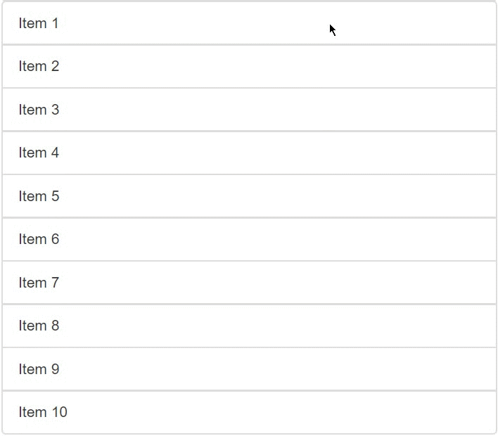

# 拖拽组件

基于 [SortableJS](https://github.com/SortableJS/Sortable) + Element Table 进行封装, 支持自定义渲染拖拽/表格拖拽

## rowKey

渲染主键, 默认为 `id`, 仅在使用 slots.item 进行渲染时有用

```vue
<bk-draggable v-model="list" row-key="age">
  <!-- ... -->
</bk-draggable>
```

## options

透传进 SortableJS 的自定义参数, 与官方一致 

```vue
<bk-draggable v-model="list" :options="{ handler: '.handle' }">
  <!-- ... -->
</bk-draggable>
```

## multiple

是否开启批量拖拽

```vue
<bk-draggable v-model="list" multiple>
  <!-- ... -->
</bk-draggable>
```

## 普通用法

### 结合 ElTable

ElTable 用法无改变, 只需要用 `BkDraggable` 组件进行嵌套即可

```vue
<bk-draggable v-model="list">
  <bk-table ref="refList" stripe border :data="list" row-key="age">
    <bk-table-column prop="name" label="姓名">
      <template #default="scope">
        <el-input v-model="scope.row.name" />
      </template>
    </bk-table-column>
    <bk-table-column prop="age" label="年龄">
      <template #default="scope">
        <el-input v-model="scope.row.age" />
      </template>
    </bk-table-column>
  </bk-table>
</bk-draggable>
```

### 自定义列表选择

自定义列表渲染必须自定义设置 `:key` 避免重新渲染异常

```vue
<bk-draggable v-model="list">
  <div v-for="item in list" :key="item.age">{{ item }}</div>
</bk-draggable>
```

### 使用 slots.item 进行渲染

使用该方式进行渲染时需要考虑 `rowKey` 参数避免排序重新渲染时异常

```vue
<bk-draggable v-model="list" row-key="age">
  <span slot="item" slot-scope="{ item }">{{ item }}</span>
</bk-draggable>
```

**另外需要注意的是, 由于 vue2 的渲染问题, 在内部渲染 `slots.item` 时会用 `<span>` 标签作为父组件进行渲染**

## 批量拖拽

批量拖拽在 sortablejs 的 [Multiple](https://github.com/SortableJS/Sortable/wiki/Dragging-Multiple-Items-in-Sortable) 模块下进行封装, **批量拖拽需要基于用户选择后再进行拖拽**

选中后会注入一个全局 class `.bk-draggable-multiple-selected`, 具体业务可根据自身选择设置选中样式

但开启批量拖拽后需要注意两个参数: `drag_${parent}` `dragid_${parentid}`
- drag_: 用于关联多条数据是否同一个父类(非必传, 目前只用于 ElTable 表格的单元格合并场景)
- dragid_: 标识每个数据主键, 用于拖拽后的数据重排

### 结合 ElTable

1. table 表格开启批量拖拽后需要设置 `row-class-name` 参数, `dragid_` 开头的类名
2. 如果存在单元格合并, 并需要拖拽一个合并单元格直接拖拽多行数据, 则需要返回以 `drag_` 开头的类名

**基于以上第 2 点进行拖拽会导致表格在拖拽过程中出现错位的问题, 拖拽结束后会刷新列表解决这个问题**

**由于 DOM 结构问题目前暂不解决拖拽过程的错位问题, 如无法接受可采用其他替代方案**



```vue
<bk-draggable v-model="list" multiple row-key="age">
  <bk-table 
    ref="refList" 
    :data="list"
    :row-class-name="({ row }) => `drag_${row.name} dragid_${row.age}`" 
    row-key="age"
  >
    <bk-table-column prop="name" label="姓名">
      <template #default="scope">
        <el-input v-model="scope.row.name" />
      </template>
    </bk-table-column>
    <bk-table-column prop="age" label="年龄">
      <template #default="scope">
        <el-input v-model="scope.row.age" />
      </template>
    </bk-table-column>
  </bk-table>
</bk-draggable>
```


### 自定义列表选择

只需要设置 `dragid_` 即可

```vue
<bk-draggable v-model="list" multiple row-key="age">
  <div v-for="item in list" :key="item.age" :class="`dragid_${item.age}`">
    {{ item }}
  </div>
</bk-draggable>
```

### 使用 slots.item 进行渲染

只需要设置 `dragid_` 即可

```vue
 <bk-draggable v-model="list" multiple row-key="age">
  <template #item="{ item }">
    <div :key="item.age" :class="`dragid_${item.age}`">
      {{ item }}
    </div>
  </template>
</bk-draggable>
```
